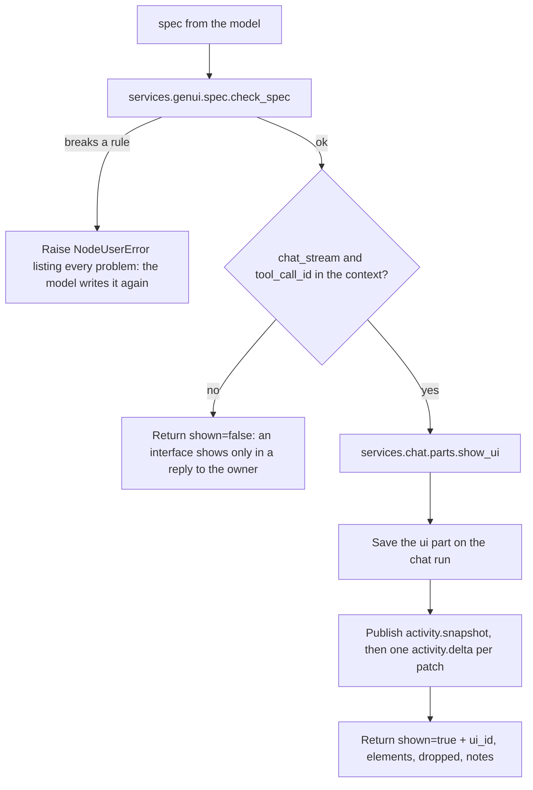

# Show UI (`chatUi`)

| Field | Value |
|------|-------|
| **Category** | chat_utility (group `("chat", "tool")`) |
| **Backend handler** | [`server/nodes/chat/chat_ui/__init__.py`](../../../server/nodes/chat/chat_ui/__init__.py) — `ChatUiNode`; dispatch via `BaseNode.execute()` + `@Operation("show")` |
| **Tests** | [`server/tests/nodes/test_chat_ui.py`](../../../server/tests/nodes/test_chat_ui.py), [`server/tests/services/genui/`](../../../server/tests/services/genui/), [`server/tests/services/chat/test_parts.py`](../../../server/tests/services/chat/test_parts.py) |
| **Skill (if any)** | - |
| **Dual-purpose tool** | no: a tool only (`component_kind = "tool"`, tool name `show_ui`) |

## Purpose

Lets an employee put a small interface inside its chat reply: a choice to
make, a short form, numbers, a chart, buttons. The agent calls `show_ui`
with a json-render spec; the owner sees it under the reply, uses it, and its
buttons either ask something in the owner's name or come back to the agent
as the owner's next turn. Wire it to the `input-tools` handle of the agent
that answers through Reply in Chat. See
[Chat Protocol → Generated UI](../../chat_protocol.md#generated-ui).

## Inputs (handles)

| Handle | Connection type | Required | Purpose |
|--------|-----------------|----------|---------|
| `output-tool` | tools | yes | Connects to an agent's `input-tools`. |

No main input or output: it runs only when the agent calls it.

## Parameters

| Name | Type | Default | Required | Description |
|------|------|---------|----------|-------------|
| `spec` | object | - | yes | The interface as json-render's flat spec `{root, state, elements}`. A JSON string is read as the object it encodes (some providers send object arguments as strings). |

The tool description is generated from
[`server/config/chat_genui_catalog.json`](../../../server/config/chat_genui_catalog.json)
by `services/genui/spec.py` `describe_catalog`: the components with their
props, which prop each input binds, what each layout may hold, the state and
condition syntax, the actions and the limits. `tool_schema_locked` pins it
against stale persisted ToolSchema rows.

## Outputs (handles)

### Output payload (TypeScript shape)

```ts
// ChatUiOutput (model_config extra="allow"): what the model reads back
{
  shown: boolean;                 // false outside a reply to the owner's chat message
  ui_id?: string;                 // the part id, "ui_<16 hex>"
  elements?: number;              // elements the interface kept
  dropped?: {id: string; reason: string}[];  // unknown types, unreachable elements
  notes?: string[];               // stray fields and props left out, and why
  message?: string;
}
```

## Logic Flow



## Decision Logic

- **Refused** (every problem in one `NodeUserError`): not an object; a root
  that is not an element of a known type; a child that is not an element or
  that its parent may not hold (a Row holds Buttons, a Card holds Select,
  Toggle, TextField and Text); a cycle or a child with two parents; more than
  24 elements, 6 levels, 12 children or 16384 bytes; a prop its component's
  JSON Schema refuses; `$bindState` on a prop other than the input's bound
  one; a state path through `__proto__`, `constructor` or `prototype`; an
  action name that is not one (`push`, `pop`, `pushState`, `removeState` and
  `validateForm` are kept by the chat); params starting `__`.
- **Left out and reported**: elements of an unknown type (and children
  naming them), elements the root does not reach, element fields other than
  `type`, `props`, `children`, `visible` and `on`, props a component does not
  declare, `$item` / `$index` / `$bindItem` / `$computed`.
- **Where it shows**: only a tool call of the agent answering a chat run
  carries `chat_stream` (`agent.prepare_payload` -> AgentWorkflow ->
  `BaseNode.as_activity` extras). A canvas Run, a delegated agent or a
  schedule gets `shown: false`.
- **No step**: `chat_step_hidden = True`; the interface is what shows.

## Side Effects

- **Database writes**: one `chat_run_parts` row (`kind = "ui"`, key
  `ui:<part id>`, payload `{part_id, spec, state, state_revision: 0,
  elements}`); a retried call writes the same row. Reply in Chat copies the
  run's parts onto its reply; the run's end seals any later ones, creating an
  empty-text reply when the run wrote nothing.
- **Broadcasts**: `chat_run_event` frames (`activity.snapshot`,
  `activity.delta`, `activity_type: "json_render"`) to the session's
  subscribed sockets only (`services/chat/hub.py`).
- **External API calls**, **file I/O**, **subprocess**: none.

## External Dependencies

- **Credentials**: none.
- **Services**: `services.genui.spec`, `services.genui.patches`,
  `services.chat.parts`, the database.
- **Python packages**: `jsonschema` (a direct dependency).
- **Environment variables**: none.

## Edge cases & known limits

- The client checks the spec again before drawing it
  (`client/src/features/chat/genui/prepare.ts` with `lib/jsonRender`), and a
  test on each side holds the two catalogues to each other.
- Allowed for Hire by `node_allowlist.json` `enabled_nodes`; the employee
  builder does not wire it into new hires yet.

## Related

- **Other nodes**: [`chatReply`](./chatReply.md) (the answer it sits under),
  [`chatTrigger`](../workflow_triggers/chatTrigger.md).
- **Architecture docs**: [Chat Protocol](../../chat_protocol.md).
